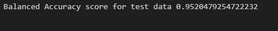
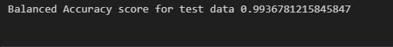
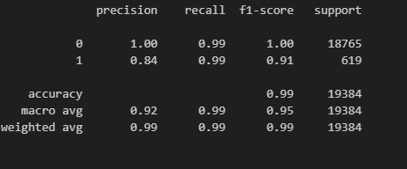

# Credit Risk Report

## Overview of the Analysis

In this section, describe the analysis you completed for the machine learning models used in this Challenge. This might include:

* The purpose of the analysis is to determine the creditworthiness of borrowers.
* A dataset containing lending data and loan status data was used.
* The Dependent Variable was allocated to 'loan status' (y_value). The Independent Variables were made up of 'loan size', 'interest rate', 'borrower Income', 'debt to income', 'num of accounts', 'derogatory_marks' and 'total debt (X_value).
* Stages of the machine learning process were as follows, 
      * Import the required modules. 
      * Read in the lending data file and create a DataFrame. 
      * Extract the y_values from the DataFrame. 
      * Split the data into Training and Test datasets. 
      * Create a logistic regression model. 
      * Predict and evaluate the model. 
      * Generate a Classification Report 
     
* A Logistic Regression Model was used to determine the results.

## Results

* Machine Learning Model 1:
  * A Logistic Regression Model gave the following results using the original data

 

The machine learning model results on the original data are as follows.
  * Accuracy score of 0.99, indicating it correctly predicted 99% of all instances. 
  * A precision score of 1.00 for the healthy loan class and 0.85 for the high-risk loan class. 
  * The recall score for the healthy loan class is 0.99 and for the high-risk loan class is 0.91. 
  * The F1-scores for healthy loan and high-risk loan classes are 1.00 and 0.88, respectively. 
  * Overall, the model performs well, with slightly lower precision and recall scores for high-risk loans, but still effective in identifying them.
 

* Machine Learning Model 2:
  * A Logistic Regression Model gave the following results using the randomly over sampled data

 

The machine learning model results for the Over sampled data are as follows. 
* Accuracy score of 0.99, indicating it correctly predicted 99% of all instances. 
* A precision score of 1.00 for the healthy loan class and 0.84 for the high-risk loan class. 
* The recall score for the healthy loan class is 0.99 and for the high-risk loan class is also 0.99. 
* The F1-scores for healthy loan and high-risk loan classes are 1.00 and 0.91, respectively. 
* Overall, the model performs well, with slightly lower precision score for high-risk loans but high recall scores for both classes, indicating that the model is effective in identifying high-risk loans.

## Summary

Both models perform similarly well based on the performance metrics. including accuracy, precision, recall, f1-score, and balanced accuracy. However, with the original dataset having a significant class imbalance, the second model's use of RandomOverSampler to resample the training data and balance the class distribution appears advantageous in improving its performance on the high-risk loan class.

The resampled data gave us improved results on the recall and f1-scores as well as the balanced accuracy score.

Of the two models the resampled data does appear to be the better model option. The original dataset had a significant class imbalance, with only 2,500 high-risk loans compared to 75,036 healthy loans.  The use of RandomOverSampler to resample the training data can help address this imbalance by generating additional synthetic samples of the minority class, which can improve the model's performance in predicting the high-risk loan class.