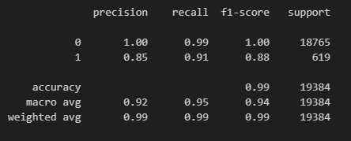

# Credit Risk Report

## Overview of the Analysis

In this section, describe the analysis you completed for the machine learning models used in this Challenge. This might include:

* The purpose of the analysis is to determine the creditworthiness of borrowers.
* A dataset containing lending data and loan status data was used.
* The Dependent Variable was allocated to 'loan status' (y_value). The Independent Variables were made up of 'loan size', 'interest rate', 'borrower Income', 'debt to income', 'num of accounts', 'derogatory_marks' and 'total debt (X_value).
* Stages of the machine learning process were as follows, 
      * Import the required modules. 
      * Read in the lending data file and create a DataFrame. 
      * Extract the y_values from the DataFrame. 
      * Split the data into Training and Test datasets. 
      * Create a logistic regression model. 
      * Predict and evaluate the model. 
      * Generate a Classification Report 
     
* A Logistic Regression Model was used to determine the results.

## Results

* Machine Learning Model 1:
  * A Logistic Regression Model gave the following results using the original data

 

* Machine Learning Model 2:
  * A Logistic Regression Model gave the following results using the randomly over sampled data

 

## Summary

Summarise the results of the machine learning models, and include a recommendation on the model to use, if any. For example:
* Which one seems to perform best? How do you know it performs best?
* Does performance depend on the problem we are trying to solve? (For example, is it more important to predict the `1`'s, or predict the `0`'s? )

We can see that the logistic regression model performs very well at predicting  the `0` (healthy loan), with a precision, and F1-score of 1.00 and recall of 0.99, indicating that it correctly identifies all healthy loans.

With a precision sore of 0.85 For the `1` (high-risk loan) the logistic regression model performs well in identifying high-risk loans, but with room for improvement, especially given the highly imbalanced nature of the dataset.

*If you do not recommend any of the models, please justify your reasoning.*

Overall i would recommend this model but would suggest that further testing is required. I would recommend using a dataset with a more even spread of healthy and high-risk loans or atleast a higher amount of high-risk loans.